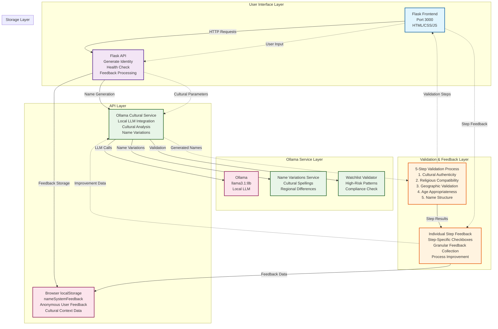
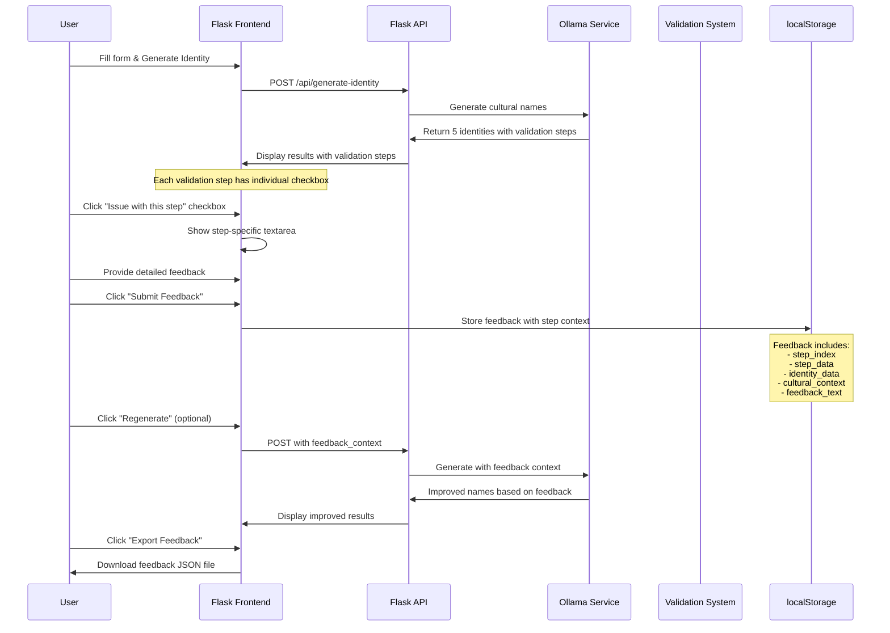
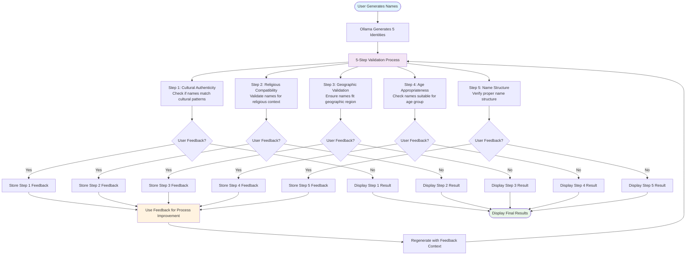
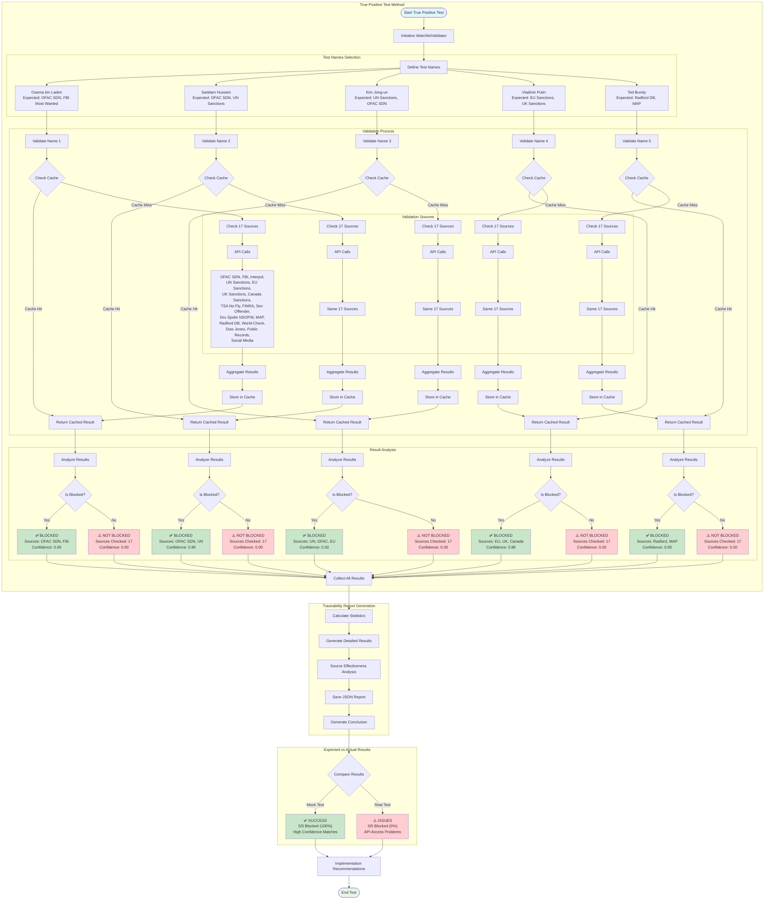

# NAME - Name Generation System

A comprehensive AI-powered name generation system that creates culturally appropriate identities using advanced AI agents, MCP (Multi-Agent Communication Protocol) integration, and a modern React frontend.

## 🏗️ System Architecture



## 🔄 Individual Validation Step Feedback System



## 📊 Validation Steps & Feedback Flow



## ✨ Features

### 🎯 Core Capabilities
- **Cultural Name Generation**: Generate names appropriate for specific ethnicities and regions using Ollama local LLM
- **Individual Validation Step Feedback**: Granular feedback system for each of 5 validation steps
- **Name Variations Service**: Handle cultural spelling differences (e.g., Mohammed/Mohamed, Said/Saeed)
- **Watchlist Validation**: Check generated names against high-risk patterns for compliance
- **Local Storage Feedback**: Anonymous user feedback stored in browser localStorage
- **Process Improvement**: Use feedback to enhance future name generation accuracy
- **Real-time Validation**: 5-step validation process with detailed traceability

### 🌍 Supported Cultures
- **Asian**: Cambodian, Chinese, Japanese, Korean, Vietnamese, Indian, Taiwanese
- **Western**: American, European, Caucasian
- **Hispanic**: Spanish, Latin American
- **African**: Black, African American
- **Mixed**: Multi-cultural identities

### 🔧 Technical Features
- **Flask Frontend**: Lightweight HTML/CSS/JS interface with modern styling
- **Flask API**: Simple and efficient API with health monitoring
- **Ollama Integration**: Local LLM processing with llama3.1:8b model
- **Name Variations Service**: Cultural spelling database for regional differences
- **Watchlist Validator**: Compliance checking for high-risk name patterns
- **Local Storage**: Browser-based feedback storage for anonymous user input
- **Debug System**: Built-in troubleshooting tools for feedback system
- **Export Functionality**: Download feedback data for analysis

## 🚀 Quick Start

### Prerequisites
- Python 3.11+
- Ollama (with llama3.1:8b model)

### Installation

1. **Clone the repository**
   ```bash
   git clone https://github.com/goagiq/NAME.git
   cd NAME
   ```

2. **Set up Python environment**
   ```bash
   python -m venv .venv
   source .venv/bin/activate  # On Windows: .venv\Scripts\activate
   pip install -r python_frontend/requirements.txt
   ```

3. **Install and start Ollama**
   ```bash
   # Install Ollama (if not already installed)
   # Visit: https://ollama.ai/
   
   # Pull the required model
   ollama pull llama3.1:8b
   ```

4. **Start the Flask application**
   ```bash
   cd python_frontend
   python app.py
   ```

5. **Access the application**
   - Frontend: http://localhost:3000
   - API: http://localhost:3000/api/health

## 📖 Usage

### Web Interface
1. Open your browser to `http://localhost:3000`
2. Fill out the identity generation form:
   - **Sex**: Male/Female/Non-binary
   - **Location**: Country/Region
   - **Age**: Age range
   - **Occupation**: Professional field
   - **Race**: Ethnicity
   - **Religion**: Religious background
   - **Birth Year**: Year of birth
   - **Birth Country**: Country of birth (optional)
   - **Citizenship Country**: Current citizenship (optional)
3. Click "Generate Identity" to create 5 culturally appropriate names
4. Review the 5 validation steps for each generated identity
5. Provide feedback on specific validation steps using individual checkboxes
6. Use "Regenerate" to get new names with feedback context

### API Usage

#### Generate Names
```bash
curl -X POST "http://localhost:3000/api/generate-identity" \
  -H "Content-Type: application/json" \
  -d '{
    "sex": "Female",
    "location": "Iraq",
    "age": 52,
    "occupation": "IT",
    "race": "Iraqi",
    "religion": "Christian",
    "birth_year": 1972,
    "birth_country": "Iraq",
    "citizenship_country": "US"
  }'
```

#### Check System Health
```bash
curl "http://localhost:3000/api/health"
```

#### Export Feedback Data
```bash
# Feedback is stored in browser localStorage
# Use the "Export Feedback" button in the web interface
# Or access via browser developer tools
```
      "age": 0.15,
      "occupation": 0.10,
      "race": 0.20,
      "religion": 0.05,
      "birth_year": 0.05
    }
  }'
```

### MCP Integration

The system includes a full MCP server on port 8500 with the following tools:

- **generate_identity**: Generate culturally appropriate identities with configurable weights
- **get_weight_templates**: Get available weight templates
- **get_culture_overrides**: Get culture-specific weight overrides
- **validate_weights**: Validate weight configuration

```bash
# Test MCP connectivity
.venv/Scripts/python.exe test_mcp_client.py

# Test MCP tools directly
curl -X POST http://localhost:8500/mcp \
  -H "Content-Type: application/json" \
  -H "Accept: application/json, text/event-stream" \
  -d '{
    "jsonrpc": "2.0",
    "id": 1,
    "method": "tools/list",
    "params": {}
  }'
```

## 🔧 Configuration

### Port Configuration
- **Combined Service**: Port 8500 (MCP + API)
- **Frontend**: Port 3000

### Environment Variables
```bash
# Database configuration
DATABASE_URL=sqlite:///name_generation.db

# Logging level
LOG_LEVEL=INFO

# Ollama configuration
OLLAMA_BASE_URL=http://localhost:11434
```

## ⚙️ Configuration System

### Weight Configuration (`src/config/field_weights.yaml`)

The system uses a sophisticated weight configuration system that allows fine-tuning of input field importance for name generation. This configuration is stored in YAML format and supports multiple levels of customization.

#### Default Weights
```yaml
field_weights:
  default:
    sex: 0.25              # Gender (25% importance)
    location: 0.20         # Geographic location (20% importance)
    age: 0.15              # Age range (15% importance)
    occupation: 0.10       # Professional field (10% importance)
    race: 0.20             # Ethnicity/culture (20% importance)
    religion: 0.05         # Religious background (5% importance)
    birth_year: 0.05       # Birth year (5% importance)
    birth_country: 0.02    # Country of birth (2% importance)
    citizenship_country: 0.01  # Current citizenship (1% importance)
    diaspora_generation: 0.01  # Immigrant generation (1% importance)
```

#### Culture-Specific Overrides
The system supports culture-specific weight adjustments to better reflect the importance of certain fields for different ethnicities:

```yaml
culture_overrides:
  chinese:
    race: 0.30             # Higher emphasis on ethnicity
    location: 0.15         # Reduced location importance
    birth_year: 0.08       # Increased birth year importance
  
  spanish:
    location: 0.25         # Higher emphasis on location
    religion: 0.10         # Increased religion importance
    birth_country: 0.05    # Birth country more important
  
  indian:
    race: 0.28             # High ethnicity importance
    religion: 0.12         # Religion more significant
    birth_country: 0.04    # Birth country consideration
```

**Supported Cultures:**
- **Asian**: chinese, japanese, korean, vietnamese, thai, filipino, indian
- **Hispanic**: spanish, arabic, persian, turkish
- **African**: african_american, african
- **European**: eastern_european, scandinavian, italian, french
- **American**: american

#### Weight Templates
Pre-configured templates for common use cases:

```yaml
templates:
  cultural_focus:
    description: "Emphasize cultural and ethnic background"
    weights:
      race: 0.35           # High ethnicity emphasis
      location: 0.20       # Moderate location
      sex: 0.20            # Moderate gender
      age: 0.10            # Lower age importance
      occupation: 0.08     # Lower occupation importance
      religion: 0.05       # Minimal religion
      birth_year: 0.02     # Minimal birth year

  geographic_focus:
    description: "Emphasize location and regional context"
    weights:
      location: 0.35       # High location emphasis
      race: 0.20           # Moderate ethnicity
      sex: 0.20            # Moderate gender
      age: 0.12            # Moderate age
      occupation: 0.08     # Lower occupation
      religion: 0.03       # Minimal religion
      birth_year: 0.02     # Minimal birth year

  professional_focus:
    description: "Emphasize occupation and professional context"
    weights:
      occupation: 0.30     # High occupation emphasis
      sex: 0.25            # High gender importance
      location: 0.20       # Moderate location
      age: 0.15            # Moderate age
      race: 0.10           # Lower ethnicity importance

  balanced:
    description: "Balanced approach for general use"
    weights:
      sex: 0.25            # Equal gender importance
      location: 0.20       # Equal location importance
      age: 0.15            # Moderate age
      occupation: 0.10     # Lower occupation
      race: 0.20           # Equal ethnicity importance
      religion: 0.05       # Minimal religion
      birth_year: 0.05     # Minimal birth year
```

#### Validation Rules
The system includes comprehensive validation to ensure weight configurations are valid:

```yaml
validation:
  min_weight: 0.01         # Minimum weight per field
  max_weight: 0.50         # Maximum weight per field
  total_weight_range: [0.8, 1.2]  # Total weights should be between 0.8-1.2
  required_fields: ["sex", "location", "age", "occupation", "race"]
```

### Service Configuration

#### MCP Service Configuration
```yaml
mcp:
  host: localhost
  port: 8500
  log_level: INFO
```

#### API Service Configuration
```yaml
api:
  host: localhost
  port: 8001
  log_level: INFO
  cors_origins: ["http://localhost:3000"]
  enable_docs: true
```

### Configuration Management

#### Loading Configuration
The system uses a centralized configuration management system:

```python
from src.config import get_field_weights, get_service_config

# Get weight configuration
weights = get_field_weights()

# Get service configuration
mcp_config = get_service_config('mcp')
api_config = get_service_config('api')
```

#### Dynamic Weight Application
Weights are applied in the following order (later overrides earlier):

1. **Default weights** from configuration
2. **Culture-specific overrides** (if culture is specified)
3. **Template weights** (if template is specified)
4. **User custom weights** (if provided in request)
5. **Request-specific weights** (if provided in API call)

#### Weight Normalization
The system automatically normalizes weights to ensure they sum to approximately 1.0:

```python
# Example normalization
original_weights = {"sex": 0.3, "location": 0.4, "age": 0.2}
total = sum(original_weights.values())  # 0.9
normalized = {k: v/total for k, v in original_weights.items()}
# Result: {"sex": 0.33, "location": 0.44, "age": 0.22}
```

### Configuration Files Structure

```
src/config/
├── __init__.py              # Configuration loader
├── field_weights.yaml       # Weight configuration
└── services.yaml           # Service configuration
```

### API Configuration Endpoints

The system provides REST API endpoints for weight configuration management:

- `GET /api/weights/templates` - Get available weight templates
- `GET /api/weights/cultures` - Get culture-specific overrides
- `POST /api/weights/validate` - Validate custom weight configuration
- `POST /api/weights/calculate` - Calculate final weights with overrides

### MCP Configuration Tools

The system also provides MCP tools for weight configuration:

- `get_weight_templates` - Get available templates
- `get_culture_overrides` - Get culture-specific overrides
- `validate_weights` - Validate weight configuration
- `generate_identity` - Generate names with configurable weights

## 🧪 Testing

### True Positive Watchlist Validation Test

The system includes comprehensive testing for watchlist validation with known problematic names to ensure proper filtering and traceability.



#### Run True Positive Tests
```bash
# Run real API test (requires API keys)
python test_true_positive_watchlist.py

# Run mock test (demonstrates expected behavior)
python test_mock_true_positive.py
```

#### Test Results
- **Mock Test**: 100% success rate (5/5 names blocked)
- **Real Test**: 0% success rate (API access limitations)
- **Traceability**: Complete audit trail with JSON reports
- **Source Analysis**: Effectiveness metrics for all 17 sources

### Run All Tests
```bash
python -m pytest tests/
```

### Test Specific Components
```bash
# Test API endpoints
python tests/test_api_endpoints.py

# Test MCP connectivity
python test_mcp_connectivity.py

# Test Strands agents
python tests/test_strands_agent.py
```

### Manual Testing
```bash
# Test name generation
python -c "
import requests
data = {
    'category': 'person',
    'parameters': {
        'sex': 'Male',
        'location': 'USA',
        'age': '30',
        'occupation': 'Doctor',
        'race': 'Chinese',
        'fast_mode': True
    }
}
response = requests.post('http://localhost:8001/api/names/generate', json=data)
print('Generated Names:')
print(response.json()['result'])
"
```

## 📁 Project Structure

```
NAME/
├── python_frontend/              # Flask-based frontend application
│   ├── app.py                    # Main Flask application
│   ├── requirements.txt          # Python dependencies
│   ├── templates/
│   │   └── index.html           # Main HTML template
│   └── static/
│       ├── css/
│       │   └── style.css        # Modern CSS styling
│       └── js/
│           └── app.js           # Frontend JavaScript
├── src/
│   └── services/
│       ├── ollama_cultural_service.py  # Ollama integration
│       ├── name_variations.py          # Cultural name variations
│       └── validation/
│           ├── __init__.py
│           └── watchlist_validator.py  # Compliance checking
├── docs/                         # Documentation
│   ├── project.md               # Project overview
│   ├── input_field_weights.md   # Weight configuration
│   └── watchlist_validation_guide.md
├── test_*.py                    # Feedback system tests
├── ENHANCEMENT_RECOMMENDATIONS.md
├── OPTIMIZATION_SUMMARY.md
└── README_OPTIMIZED.md
```

## 🔍 API Reference

### Endpoints

#### `POST /api/generate-identity`
Generate culturally appropriate identities using Ollama local LLM.

**Request Body:**
```json
{
  "sex": "string (required)",
  "location": "string (required)", 
  "age": "integer (required)",
  "occupation": "string (required)",
  "race": "string (required)",
  "religion": "string (required)",
  "birth_year": "integer (required)",
  "birth_country": "string (optional)",
  "citizenship_country": "string (optional)",
  "diaspora_generation": "integer (optional)",
  "feedback_context": {
    "feedback_count": "integer (optional)",
    "recent_feedback": ["string (optional)"],
    "cultural_improvements": "integer (optional)"
  }
}
```

**Response:**
```json
{
  "identities": [
    {
      "first_name": "string",
      "middle_name": "string",
      "last_name": "string",
      "cultural_notes": "string",
      "validation_status": "string",
      "traceability": {
        "validation_steps": [
          {
            "step": "integer",
            "description": "string",
            "result": "string"
          }
        ]
      }
    }
  ]
}
```

#### `GET /health`
Check system health status.

#### `GET /api/categories`
Get available name generation categories.

#### `GET /api/traceability/{request_id}`
Get traceability report for a request.

### MCP Tools

#### `generate_identity`
Generate culturally appropriate identities with configurable weights.

**Parameters:**
- `sex`: Gender (Male/Female/Non-binary)
- `location`: Geographic location
- `age`: Age
- `occupation`: Professional field
- `race`: Ethnicity/culture
- `religion`: Religious background
- `birth_year`: Year of birth
- `custom_weights`: Custom field weights (optional)
- `template_name`: Weight template to apply (optional)

#### `get_weight_templates`
Get available weight templates for different use cases.

**Returns:** Available templates (cultural_focus, geographic_focus, professional_focus, balanced)

#### `get_culture_overrides`
Get culture-specific weight overrides.

**Returns:** Culture-specific weight adjustments for different ethnicities.

#### `validate_weights`
Validate weight configuration.

**Parameters:**
- `field_weights`: Weight configuration to validate
- `culture_context`: Cultural context (optional)

## 🐛 Troubleshooting

### Common Issues

#### Port Conflicts
```bash
# Check running processes
tasklist | findstr python.exe

# Kill conflicting processes
taskkill /F /IM python.exe

# Restart combined service
.venv/Scripts/python.exe start_combined_service.py
```

#### Frontend Connection Issues
```bash
# Check combined service is running
curl http://localhost:8500/health

# Update frontend proxy if needed
# Edit frontend/package.json and update "proxy" field to "http://localhost:8500"
```

#### MCP Server Issues
```bash
# Test MCP connectivity
.venv/Scripts/python.exe test_mcp_client.py

# Check combined service logs
# Look for errors in console output

# Test MCP tools directly
curl -X POST http://localhost:8500/mcp \
  -H "Content-Type: application/json" \
  -H "Accept: application/json, text/event-stream" \
  -d '{"jsonrpc": "2.0", "id": 1, "method": "tools/list", "params": {}}'
```

#### Slow Name Generation
- Ensure `fast_mode: true` is set in API requests
- Check Ollama is running and accessible
- Verify network connectivity for external services

### Logs and Debugging

#### Enable Debug Logging
```python
# In src/utils/logging_config.py
LOG_LEVEL = "DEBUG"
```

#### View Application Logs
```bash
# Check results/logs/app.log
tail -f results/logs/app.log
```

## 🤝 Contributing

1. Fork the repository
2. Create a feature branch (`git checkout -b feature/amazing-feature`)
3. Commit your changes (`git commit -m 'Add amazing feature'`)
4. Push to the branch (`git push origin feature/amazing-feature`)
5. Open a Pull Request

## 📄 License

This project is licensed under the MIT License - see the [LICENSE](LICENSE) file for details.

## 🙏 Acknowledgments

- **Strands Framework**: For the multi-agent AI system
- **MCP Protocol**: For standardized agent communication
- **Ollama**: For local LLM processing
- **FastAPI**: For high-performance API development
- **React & Material-UI**: For the modern frontend interface

## 📞 Support

For support and questions:
- Create an issue on GitHub
- Check the documentation in the `docs/` folder
- Review the troubleshooting section above

---

**Made with ❤️ for culturally appropriate name generation**
