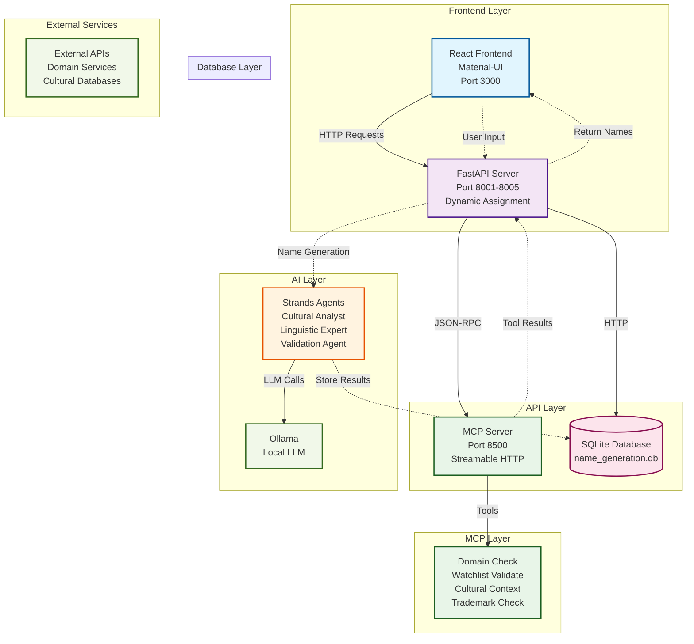

# NAME - Name Generation System

A comprehensive AI-powered name generation system that creates culturally appropriate identities using advanced AI agents, MCP (Multi-Agent Communication Protocol) integration, and a modern React frontend.

## 🏗️ System Architecture



## ✨ Features

### 🎯 Core Capabilities
- **Cultural Name Generation**: Generate names appropriate for specific ethnicities and regions
- **Multi-Agent AI System**: Uses specialized AI agents for cultural analysis, linguistic expertise, and validation
- **MCP Integration**: Full Multi-Agent Communication Protocol support with external tools
- **Fast Mode**: Quick generation using pre-defined culturally appropriate name pools
- **Swarm Mode**: Advanced generation using AI agent swarms for complex scenarios
- **Real-time Validation**: Domain availability, trademark checks, and cultural context validation

### 🌍 Supported Cultures
- **Asian**: Cambodian, Chinese, Japanese, Korean, Vietnamese, Indian, Taiwanese
- **Western**: American, European, Caucasian
- **Hispanic**: Spanish, Latin American
- **African**: Black, African American
- **Mixed**: Multi-cultural identities

### 🔧 Technical Features
- **React Frontend**: Modern UI with Material-UI components
- **FastAPI Backend**: High-performance API with automatic documentation
- **SQLite Database**: Lightweight persistence layer
- **Ollama Integration**: Local LLM processing
- **Dynamic Port Management**: Automatic port conflict resolution
- **Comprehensive Logging**: Detailed traceability and debugging

## 🚀 Quick Start

### Prerequisites
- Python 3.11+
- Node.js 16+
- Ollama (for local LLM processing)

### Installation

1. **Clone the repository**
   ```bash
   git clone https://github.com/goagiq/NAME.git
   cd NAME
   ```

2. **Install Python dependencies**
   ```bash
   # Using uv (recommended)
   uv sync
   
   # Or using pip
   pip install -r requirements.txt
   ```

3. **Install frontend dependencies**
   ```bash
   cd frontend
   npm install
   cd ..
   ```

4. **Start the system**
   ```bash
   # Start backend services (MCP + API)
   python start_services_simple.py
   
   # In a new terminal, start the frontend
   cd frontend
   npm start
   ```

## 📖 Usage

### Web Interface
1. Open your browser to `http://localhost:3000`
2. Fill out the identity generation form:
   - **Sex**: Male/Female
   - **Location**: Country/Region
   - **Age**: Age range
   - **Occupation**: Professional field
   - **Race**: Ethnicity
   - **Religion**: Religious background (optional)
   - **Birth Year**: Year of birth (optional)
3. Click "Generate Identity" to create 5 culturally appropriate names
4. Use "Regenerate" to get new names

### API Usage

#### Generate Names
```bash
curl -X POST "http://localhost:8001/api/names/generate" \
  -H "Content-Type: application/json" \
  -d '{
    "category": "person",
    "parameters": {
      "sex": "Female",
      "location": "USA",
      "age": "25",
      "occupation": "Engineer",
      "race": "Cambodian",
      "fast_mode": true
    }
  }'
```

#### Check System Health
```bash
curl "http://localhost:8001/health"
```

#### Get Available Categories
```bash
curl "http://localhost:8001/api/categories"
```

### MCP Integration

The system includes a full MCP server on port 8500 with the following tools:

- **Domain Check**: Validate domain name availability
- **Watchlist Validate**: Check names against government watchlists
- **Cultural Context Search**: Analyze cultural meaning of names
- **Trademark Check**: Validate trademark availability

```bash
# Test MCP connectivity
python test_mcp_connectivity.py
```

## 🔧 Configuration

### Port Configuration
- **MCP Server**: Port 8500 (fixed)
- **API Server**: Port 8001-8005 (dynamic assignment)
- **Frontend**: Port 3000

### Environment Variables
```bash
# Database configuration
DATABASE_URL=sqlite:///name_generation.db

# Logging level
LOG_LEVEL=INFO

# Ollama configuration
OLLAMA_BASE_URL=http://localhost:11434
```

## 🧪 Testing

### Run All Tests
```bash
python -m pytest tests/
```

### Test Specific Components
```bash
# Test API endpoints
python tests/test_api_endpoints.py

# Test MCP connectivity
python test_mcp_connectivity.py

# Test Strands agents
python tests/test_strands_agent.py
```

### Manual Testing
```bash
# Test name generation
python -c "
import requests
data = {
    'category': 'person',
    'parameters': {
        'sex': 'Male',
        'location': 'USA',
        'age': '30',
        'occupation': 'Doctor',
        'race': 'Chinese',
        'fast_mode': True
    }
}
response = requests.post('http://localhost:8001/api/names/generate', json=data)
print('Generated Names:')
print(response.json()['result'])
"
```

## 📁 Project Structure

```
NAME/
├── src/                          # Core source code
│   ├── api/                      # FastAPI application
│   ├── core/                     # Core business logic
│   ├── database/                 # Database models and operations
│   ├── services/                 # AI services and MCP integration
│   └── utils/                    # Utilities and configuration
├── frontend/                     # React frontend application
│   ├── src/
│   │   ├── components/           # React components
│   │   └── ...
│   └── package.json
├── tests/                        # Test suite
├── docs/                         # Documentation
├── results/                      # Logs and results
├── start_services_simple.py      # Main startup script
├── start_api_server.py           # API server startup
├── mcp_server_proper.py          # MCP server
├── port_manager.py               # Port management
└── test_mcp_connectivity.py      # Connectivity testing
```

## 🔍 API Reference

### Endpoints

#### `POST /api/names/generate`
Generate culturally appropriate names.

**Request Body:**
```json
{
  "category": "person",
  "parameters": {
    "sex": "string",
    "location": "string", 
    "age": "string",
    "occupation": "string",
    "race": "string",
    "religion": "string (optional)",
    "birth_year": "string (optional)",
    "fast_mode": "boolean (default: true)"
  }
}
```

**Response:**
```json
{
  "success": true,
  "category": "person",
  "parameters": {...},
  "result": "Generated names text",
  "mode": "fast|swarm"
}
```

#### `GET /health`
Check system health status.

#### `GET /api/categories`
Get available name generation categories.

#### `GET /api/traceability/{request_id}`
Get traceability report for a request.

### MCP Tools

#### `domain_check`
Check domain name availability.

#### `watchlist_validate`
Validate names against government watchlists.

#### `cultural_context_search`
Analyze cultural meaning and context of names.

#### `trademark_check`
Check trademark availability in specific industries.

## 🐛 Troubleshooting

### Common Issues

#### Port Conflicts
```bash
# Check running processes
tasklist | findstr python.exe

# Kill conflicting processes
taskkill /F /IM python.exe

# Restart services
python start_services_simple.py
```

#### Frontend Connection Issues
```bash
# Check API server is running
curl http://localhost:8001/health

# Update frontend proxy if needed
# Edit frontend/package.json and update "proxy" field
```

#### MCP Server Issues
```bash
# Test MCP connectivity
python test_mcp_connectivity.py

# Check MCP server logs
# Look for errors in console output
```

#### Slow Name Generation
- Ensure `fast_mode: true` is set in API requests
- Check Ollama is running and accessible
- Verify network connectivity for external services

### Logs and Debugging

#### Enable Debug Logging
```python
# In src/utils/logging_config.py
LOG_LEVEL = "DEBUG"
```

#### View Application Logs
```bash
# Check results/logs/app.log
tail -f results/logs/app.log
```

## 🤝 Contributing

1. Fork the repository
2. Create a feature branch (`git checkout -b feature/amazing-feature`)
3. Commit your changes (`git commit -m 'Add amazing feature'`)
4. Push to the branch (`git push origin feature/amazing-feature`)
5. Open a Pull Request

## 📄 License

This project is licensed under the MIT License - see the [LICENSE](LICENSE) file for details.

## 🙏 Acknowledgments

- **Strands Framework**: For the multi-agent AI system
- **MCP Protocol**: For standardized agent communication
- **Ollama**: For local LLM processing
- **FastAPI**: For high-performance API development
- **React & Material-UI**: For the modern frontend interface

## 📞 Support

For support and questions:
- Create an issue on GitHub
- Check the documentation in the `docs/` folder
- Review the troubleshooting section above

---

**Made with ❤️ for culturally appropriate name generation**
