# Watchlist Validation System Guide

## Overview

The Watchlist Validation System is a comprehensive solution for validating generated names against publicly available government and industry watchlists. This system ensures that generated identities do not match known criminals, terrorists, sanctioned individuals, or other problematic entities.

## Features

### 🔍 Comprehensive Coverage
- **Government Watchlists**: OFAC, FBI, Interpol, UN Sanctions
- **International Databases**: EU, UK, Canada Sanctions
- **Aviation Security**: TSA No Fly List (public data)
- **Financial Crime**: FINRA BrokerCheck
- **Law Enforcement**: National Sex Offender Registry, Dru Sjodin NSOPW, Murder Accountability Project (MAP), Radford/FGCU Serial Killer Database
- **Industry Watchlists**: World-Check, Dow Jones Risk & Compliance
- **Public Records**: Comprehensive public records search
- **Social Media**: Risk assessment across social platforms

### ⚡ Performance Optimizations
- **Async Processing**: Concurrent validation against multiple sources
- **Intelligent Caching**: 24-hour cache with configurable duration
- **Rate Limiting**: Respects API rate limits for each source
- **Fuzzy Matching**: Advanced name matching algorithms
- **Batch Processing**: Validate multiple names simultaneously

### 🛡️ Security & Compliance
- **Audit Logging**: Complete validation history
- **Confidence Scoring**: Reliability metrics for each validation
- **Source Attribution**: Detailed source information for blocked names
- **Configurable Sources**: Enable/disable specific validation sources

## Architecture

```mermaid
graph TB
    subgraph "Validation Request"
        NAME[Generated Name]
        CATEGORY[Category: person/project/etc]
    end
    
    subgraph "Watchlist Validator"
        CACHE[Cache Check]
        VALIDATOR[Async Validator]
        RESULTS[Result Aggregation]
    end
    
    subgraph "Validation Sources"
        OFAC[OFAC SDN]
        FBI[FBI Most Wanted]
        INTERPOL[Interpol Red Notices]
        UN[UN Sanctions]
        EU[EU Sanctions]
        UK[UK Sanctions]
        CANADA[Canada Sanctions]
        TSA[TSA No Fly]
        FINRA[FINRA BrokerCheck]
        SEX_OFFENDER[Sex Offender Registry]
        DRU_SJODIN[Dru Sjodin NSOPW]
        MAP[Murder Accountability Project]
        RADFORD[Radford Serial Killer DB]
        WORLD_CHECK[World-Check]
        DOW_JONES[Dow Jones]
        PUBLIC[Public Records]
        SOCIAL[Social Media]
    end
    
    subgraph "Database"
        CACHE_DB[Cache Database]
        LOGS[Validation Logs]
        STATS[Statistics]
    end
    
    NAME --> CACHE
    CACHE -->|Cache Hit| RESULTS
    CACHE -->|Cache Miss| VALIDATOR
    VALIDATOR --> OFAC
    VALIDATOR --> FBI
    VALIDATOR --> INTERPOL
    VALIDATOR --> UN
    VALIDATOR --> EU
    VALIDATOR --> UK
    VALIDATOR --> CANADA
    VALIDATOR --> TSA
    VALIDATOR --> FINRA
    VALIDATOR --> SEX_OFFENDER
    VALIDATOR --> DRU_SJODIN
    VALIDATOR --> MAP
    VALIDATOR --> RADFORD
    VALIDATOR --> WORLD_CHECK
    VALIDATOR --> DOW_JONES
    VALIDATOR --> PUBLIC
    VALIDATOR --> SOCIAL
    VALIDATOR --> RESULTS
    RESULTS --> CACHE_DB
    RESULTS --> LOGS
    RESULTS --> STATS
```



## Installation

### Prerequisites
- Python 3.11+
- SQLite database (created automatically)
- Internet connection for API access

### Dependencies
```bash
pip install aiohttp
```

### File Structure
```
src/services/validation/
├── watchlist_validator.py    # Main validation service
├── __init__.py
└── test_watchlist_validation.py  # Test script
```

## Configuration

### API Keys Setup

#### OFAC Specially Designated Nationals (SDN)
1. Visit: https://developer.trade.gov/consolidated-screening-list.html
2. Register for API access
3. Obtain API key
4. Configure in validator:
```python
validator.configure_api_key("ofac_sdn", "your_api_key_here")
```

#### FINRA BrokerCheck
1. Visit: https://www.finra.org/brokercheck
2. Register for API access
3. Obtain API key
4. Configure in validator:
```python
validator.configure_api_key("finra_brokercheck", "your_api_key_here")
```

#### World-Check (Thomson Reuters)
1. Visit: https://risk.lexisnexis.com/world-check
2. Contact sales for API access
3. Obtain API credentials
4. Configure in validator:
```python
validator.configure_api_key("world_check", "your_api_key_here")
```

#### Dow Jones Risk & Compliance
1. Visit: https://www.dowjones.com/risk-compliance/
2. Contact sales for API access
3. Obtain API credentials
4. Configure in validator:
```python
validator.configure_api_key("dow_jones", "your_api_key_here")
```

### Source Configuration

#### Enable/Disable Sources
```python
# Enable specific sources
validator.enable_source("fbi_wanted", True)
validator.enable_source("interpol_red", True)

# Disable sources that require API keys (if not configured)
validator.enable_source("ofac_sdn", False)
validator.enable_source("world_check", False)
```

#### Rate Limiting
Each source has built-in rate limiting:
- OFAC SDN: 60 requests/minute
- FBI Most Wanted: 30 requests/minute
- Interpol Red Notices: 20 requests/minute
- UN Sanctions: 10 requests/minute
- EU/UK/Canada Sanctions: 5 requests/minute
- TSA No Fly: 5 requests/minute
- FINRA BrokerCheck: 30 requests/minute
- Sex Offender Registry: 10 requests/minute
- Dru Sjodin NSOPW: 10 requests/minute
- Murder Accountability Project (MAP): 5 requests/minute
- Radford Serial Killer Database: 5 requests/minute
- World-Check: 100 requests/minute
- Dow Jones: 50 requests/minute
- Public Records: 20 requests/minute
- Social Media: 30 requests/minute

## Usage

### Basic Usage

#### Standalone Validation
```python
import asyncio
from src.services.validation.watchlist_validator import validate_name_standalone

async def validate_name():
    result = await validate_name_standalone("John Smith", "person")
    
    if result.is_blocked:
        print(f"❌ BLOCKED: {result.name}")
        print(f"Sources: {', '.join(result.sources)}")
        print(f"Reasons: {'; '.join(result.reasons)}")
        print(f"Confidence: {result.confidence:.2f}")
    else:
        print(f"✅ CLEAR: {result.name}")
        print(f"Sources checked: {len(result.raw_data)}")
        print(f"Confidence: {result.confidence:.2f}")

asyncio.run(validate_name())
```

#### Using the Validator Class
```python
import asyncio
from src.services.validation.watchlist_validator import WatchlistValidator

async def validate_names():
    async with WatchlistValidator() as validator:
        # Configure API keys
        validator.configure_api_key("ofac_sdn", "your_api_key")
        
        # Validate single name
        result = await validator.validate_name("John Smith", "person")
        print(f"Result: {result}")
        
        # Validate multiple names
        names = ["John Smith", "Jane Doe", "Bob Johnson"]
        results = await validator.validate_batch(names, "person")
        
        for name, result in zip(names, results):
            status = "BLOCKED" if result.is_blocked else "CLEAR"
            print(f"{name}: {status}")

asyncio.run(validate_names())
```

### MCP Integration

#### Using MCP Tools
```python
import aiohttp
import json

async def test_mcp_watchlist():
    mcp_url = "http://localhost:8500/mcp"
    
    test_data = {
        "jsonrpc": "2.0",
        "id": "test-1",
        "method": "tools/call",
        "params": {
            "name": "comprehensive_watchlist_check",
            "arguments": {
                "name": "John Smith",
                "category": "person"
            }
        }
    }
    
    headers = {
        "Content-Type": "application/json",
        "Accept": "application/json, text/event-stream"
    }
    
    async with aiohttp.ClientSession() as session:
        async with session.post(mcp_url, json=test_data, headers=headers) as response:
            result = await response.json()
            print(f"MCP Result: {result}")

asyncio.run(test_mcp_watchlist())
```

### Integration with Name Generation

#### Validation Agent Integration
```python
from src.services.ai.strands_agent import StrandsAgentManager

# Create validation agent with MCP tools
validation_agent = StrandsAgentManager().create_validation_agent()

# Use in name generation workflow
async def generate_and_validate_names(parameters):
    # Generate names
    names = await generate_names(parameters)
    
    # Validate each name
    for name in names:
        validation_result = await validation_agent.validate_name(name)
        if validation_result.is_blocked:
            # Regenerate name if blocked
            new_name = await regenerate_name(parameters)
            # Re-validate new name
            # ... continue until valid name found
```

## Database Schema

### Cache Table
```sql
CREATE TABLE watchlist_cache (
    id INTEGER PRIMARY KEY AUTOINCREMENT,
    name_hash TEXT UNIQUE NOT NULL,
    full_name TEXT NOT NULL,
    is_blocked BOOLEAN NOT NULL,
    sources TEXT NOT NULL,
    confidence REAL NOT NULL,
    reasons TEXT NOT NULL,
    raw_data TEXT NOT NULL,
    created_at TIMESTAMP DEFAULT CURRENT_TIMESTAMP,
    expires_at TIMESTAMP NOT NULL
);
```

### Validation Sources Table
```sql
CREATE TABLE validation_sources (
    id INTEGER PRIMARY KEY AUTOINCREMENT,
    source_name TEXT UNIQUE NOT NULL,
    last_check TIMESTAMP,
    status TEXT DEFAULT 'active',
    error_count INTEGER DEFAULT 0
);
```

### Validation Logs Table
```sql
CREATE TABLE validation_logs (
    id INTEGER PRIMARY KEY AUTOINCREMENT,
    name TEXT NOT NULL,
    source TEXT NOT NULL,
    result TEXT NOT NULL,
    response_time REAL,
    timestamp TIMESTAMP DEFAULT CURRENT_TIMESTAMP
);
```

## API Reference

### WatchlistValidator Class

#### Methods

##### `__init__(db_path: str = "name_generation.db")`
Initialize the validator with database path.

##### `configure_api_key(source_name: str, api_key: str)`
Configure API key for a specific source.

##### `enable_source(source_name: str, enabled: bool = True)`
Enable or disable a validation source.

##### `async validate_name(name: str, category: str = "person") -> WatchlistResult`
Validate a single name against all enabled sources.

##### `async validate_batch(names: List[str], category: str = "person") -> List[WatchlistResult]`
Validate multiple names concurrently.

##### `get_validation_stats() -> Dict[str, Any]`
Get validation statistics and cache information.

##### `clear_cache()`
Clear all cached validation results.

### WatchlistResult Class

#### Properties

##### `name: str`
The validated name.

##### `is_blocked: bool`
Whether the name was blocked by any source.

##### `sources: List[str]`
List of sources that blocked the name.

##### `confidence: float`
Confidence score (0.0 to 1.0) for the validation result.

##### `reasons: List[str]`
Reasons why the name was blocked.

##### `last_updated: datetime`
Timestamp of the validation.

##### `raw_data: Dict[str, Any]`
Raw data from all validation sources.

## Testing

### Run Test Script
```bash
python test_watchlist_validation.py
```

### Test Specific Functionality
```python
# Test individual validation
result = await validate_name_standalone("John Smith", "person")
print(f"Test result: {result}")

# Test batch validation
names = ["John Smith", "Jane Doe", "Bob Johnson"]
results = await validator.validate_batch(names, "person")
for result in results:
    print(f"Batch result: {result}")

# Test statistics
stats = validator.get_validation_stats()
print(f"Statistics: {stats}")
```

## Troubleshooting

### Common Issues

#### Import Errors
```
ImportError: No module named 'aiohttp'
```
**Solution**: Install aiohttp
```bash
pip install aiohttp
```

#### API Key Errors
```
Warning: OFAC API key not configured
```
**Solution**: Configure API key or disable source
```python
validator.configure_api_key("ofac_sdn", "your_api_key")
# OR
validator.enable_source("ofac_sdn", False)
```

#### Rate Limiting
```
Warning: API rate limit exceeded
```
**Solution**: Wait for rate limit reset or reduce request frequency.

#### Database Errors
```
Database initialization failed
```
**Solution**: Check file permissions and SQLite installation.

### Performance Optimization

#### Cache Management
- Default cache duration: 24 hours
- Adjust cache duration based on source update frequency
- Clear cache periodically for fresh data

#### Source Selection
- Enable only necessary sources
- Disable sources requiring API keys if not configured
- Monitor source availability and error rates

#### Batch Processing
- Use batch validation for multiple names
- Process names in groups of 10-50 for optimal performance
- Monitor memory usage with large batches

## Security Considerations

### Data Privacy
- Validation results are cached locally
- No personal data is transmitted to external sources
- API keys should be stored securely

### Rate Limiting
- Respect API rate limits for each source
- Implement exponential backoff for failed requests
- Monitor usage to avoid service disruption

### Audit Trail
- All validations are logged with timestamps
- Source attribution for blocked names
- Confidence scores for result reliability

## Compliance

### Regulatory Requirements
- OFAC compliance for US sanctions
- EU sanctions compliance
- UK sanctions compliance
- Canada sanctions compliance

### Industry Standards
- Financial crime prevention
- Anti-money laundering (AML)
- Know Your Customer (KYC)
- Enhanced Due Diligence (EDD)

## Support

### Documentation
- This guide provides comprehensive usage instructions
- API reference for all methods and classes
- Troubleshooting section for common issues

### Testing
- Test script included for validation
- Example usage patterns provided
- Performance benchmarks available

### Updates
- Regular updates for new watchlist sources
- API endpoint changes and improvements
- Security patches and compliance updates

---

**Note**: This system is designed for educational and development purposes. For production use, ensure compliance with all applicable laws and regulations regarding data access and usage.
